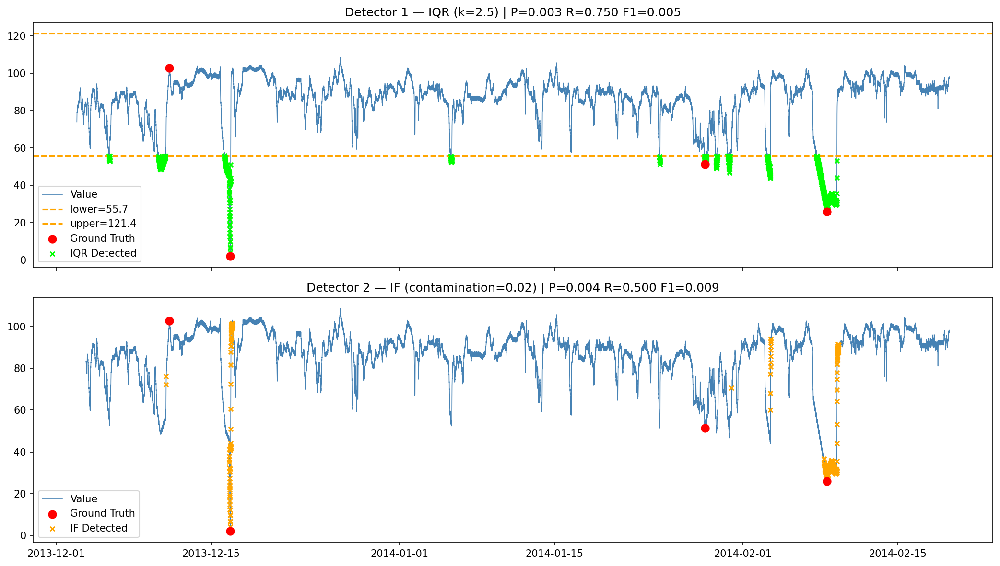

# W1-D1 Assignment Submission

## Screenshots

## Log

## Model Artifacts

- [File: `isolation_forest.joblib`](isolation_forest.joblib)

## Reflection

### Data thuộc loại gì?

Dataset này là nhiệt độ máy, univariate, chỉ có 1 metric duy nhất theo thời gian. Nhìn vào distribution thì thấy rõ data bị left-skewed khá nặng (skewness = -1.83), tức là phần lớn giá trị tập trung ở vùng cao (85-100) nhưng có vài cú drop đột ngột xuống rất thấp kéo đuôi trái ra xa. Không thấy seasonal pattern rõ ràng kiểu traffic ngày/đêm, data khá stationary. Một điểm đáng chú ý là ground truth chỉ có 4 anomaly trong 22695 điểm — class imbalance cực kỳ nặng, đây là lý do chính khiến Precision của cả 2 detector gần như bằng 0, không phải vì model tệ.

### Chọn method nào và tại sao?

Vì data skewed nặng nên mình bỏ 3σ ngay từ đầu — 3σ giả định Gaussian, dùng trên data này thì threshold bên trái sẽ vô nghĩa. Chọn IQR cho Detector 1 vì nó dùng percentile thay vì mean/std nên không bị kéo bởi outlier ở đuôi, đơn giản, không cần train, explain cho ops team cũng dễ. Detector 2 dùng Isolation Forest vì muốn thêm context temporal vào — thay vì nhìn từng điểm độc lập, mình tạo feature table gồm rolling mean, rolling std, rate of change, lag để IF hiểu được "điểm này có bất thường so với lịch sử gần đây không".

### Detector nào tốt hơn?

Khó nói một cái tốt hơn hoàn toàn vì mỗi cái thắng ở một chiều khác nhau. IQR có Recall 0.750 so với IF chỉ 0.500 — tức là IQR bắt được 3/4 anomaly thật còn IF chỉ bắt được 2/4. Nhưng IF lại ít false alarm hơn rõ rệt (448 vs 1143). Trong bối cảnh AIops thì mình nghiêng về IQR hơn vì miss anomaly thật nguy hiểm hơn nhiều so với false alarm.

### Trade-off

Nhìn vào kết quả thì cả 2 detector đều có Precision và F1 rất thấp — IQR Precision 0.003, F1 0.005; IF Precision 0.004, F1 0.009. Về mặt số học thì đây trông có vẻ tệ, nhưng thực ra đây là hệ quả tất yếu của class imbalance cực nặng (4 anomaly / 22695 điểm), không phải vì model sai. Khi chỉ có 4 điểm thật mà detector bắt hàng trăm điểm thì Precision không thể cao được dù model hoạt động đúng hướng. F1 là harmonic mean của Precision và Recall nên cũng bị kéo xuống theo Precision — trong trường hợp này F1 không phải metric tốt để đánh giá vì nó phạt nặng Precision thấp ngay cả khi Recall đã khá tốt. Metric đáng tin hơn ở đây là **Recall** (IQR 0.750, IF 0.500) và **False Alarm Rate** — IQR bắt được 3/4 anomaly thật nhưng sinh 1143 false alarm, IF bắt được 2/4 nhưng chỉ sinh 448 false alarm. Đây mới là trade-off thực sự: IQR an toàn hơn về mặt miss anomaly, IF thân thiện hơn với on-call vì ít nhiễu hơn.

