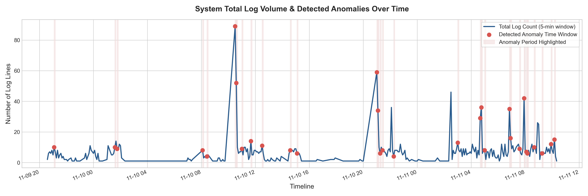
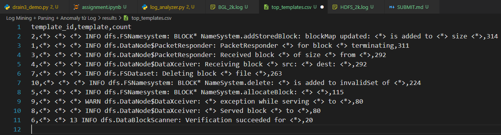
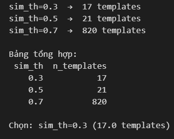

# BÁO CÁO BÀI LÀM: LOG MINING & PARSING WITH DRAIN3

## 1. Screenshots & Visualization

### 1.1. Plot Template Count Time Series

### 1.2. Anomaly Highlighted

---

## 2. Log Outputs & Tuning Experiments

### 2.1. Kết quả Output Drain3 từ Mini Log Analyzer
Dưới đây là kết quả thực tế thu được khi chạy script phân tích trên 2 tập dữ liệu mẫu (2,000 dòng đầu):

- Tổng templates tìm được: 17

 

## 3. Reflection & Discussion

### 3.1. Thuật toán Drain3 hoạt động tốt không?
Dựa trên kết quả thực nghiệm với cả hai tập dữ liệu HDFS và BGL, thuật toán Drain3 thể hiện những ưu và nhược điểm rõ rệt:

Về tổng thể, Drain3 là một bộ online parser cực kỳ đáng tiền nhờ cấu trúc cây phân cấp có chiều sâu cố định. Nó chạy rất nhanh (độ phức tạp tiệm cận $O(1)$) và xử lý luồng dữ liệu streaming mượt mà.Tuy nhiên, điểm yếu chí mạng của nó là phụ thuộc quá nặng vào bước Tiền xử lý (Preprocessing). Drain3 phân tách nhánh dựa trên các từ đầu tiên của dòng log. Đối với một tập log  như BGL, nếu chúng ta không viết hàm lọc bỏ các chuỗi mã thiết bị cứng đầu dòng, cây Drain3 sẽ bị loạn và tạo ra hàng trăm template ảo. Ngoài ra, việc tinh chỉnh sim_th cũng tốn khá nhiều thời gian chạy thử nghiệm để tìm ra điểm cân bằng.

---

### 3.2. Template nào mang lại Insight giá trị nhất cho kỹ sư vận hành (Ops)?
Việc bóc tách log thành các Template ID giúp chúng ta nhìn ra "sức khỏe" và hành vi của hệ thống thay vì phải đọc từng dòng chữ raw:

* **Insight từ tập dữ liệu HDFS:**
  * `Template ID 05`: `dfs.FSNamesystem: BLOCK* NameSystem.allocateBlock: <*> <*>`.
  * **Giá trị Ops:** Khi hệ thống phân tích phát hiện template này tăng đột biến trong giờ cuối (từ mức nền lịch sử 2.89 dòng/giờ vọt lên 9 dòng/giờ), đây là một **Insight về mặt hiệu năng (Performance Signal)**. Nó cảnh báo hệ thống đang chịu một đợt tải ghi file dồn dập (Write-heavy burst) từ Client, NameNode đang phải liên tục cấp phát block mới trên ổ đĩa. Kỹ sư có thể dựa vào đây để kiểm tra băng thông mạng hoặc IOPS của ổ cứng.

* **Insight từ tập dữ liệu BGL:**
  * `Template ID 37`: `KERNEL INFO <*> floating point alignment exceptions`
  * `Template ID 03`: `KERNEL INFO CE sym <*> at <*> mask <*>`.
  * **Giá trị Ops:** Đây là các **Insight về mặt chẩn đoán lỗi phần cứng mức thấp (Hardware Diagnostic)**. Cụm câu lệnh này phản ánh các lỗi tính toán số thực dấu phẩy động và lỗi mã sửa sai bộ nhớ (Correctable Error) trên các thanh RAM của siêu máy tính. Theo dõi tần suất xuất hiện của các ID này giúp đội ngũ Ops thực hiện **Bảo trì chủ động (Proactive Maintenance)**: Lên kế hoạch thay thế thanh RAM lỗi trước khi nó biến thành Uncorrectable Error và kéo sập toàn bộ Node vật lý.

---

### 3.3. Sự khác biệt cốt lõi giữa Metric (Số chỉ) và Log (Nhật ký) trong Giám sát hệ thống
Trong kiến trúc Giám sát toàn diện (Observability), Metric và Log là hai trụ cột bổ trợ nhau nhưng có bản chất kỹ thuật hoàn toàn khác biệt:

- Metrics (Số chỉ định lượng): Giống như một cái đồng hồ đo nhiệt độ cơ thể. Nó lưu trữ dữ liệu dạng số theo thời gian (CPU%, RAM%, số lượng request/giây). Điểm mạnh của Metric là cực kỳ nhẹ, lưu trữ tốn ít tiền, truy vấn nhanh nên rất hợp để làm Dashboard tổng quan và cài Rule cảnh báo (Ví dụ: CPU > 90% thì báo động). Tuy nhiên, Metric chỉ trả lời được câu hỏi: "Hệ thống CÓ ĐANG BỊ BỆNH KHÔNG?" chứ hoàn toàn bất lực trong việc giải thích tại sao bị bệnh.

- Logs (Nhật ký định tính): Giống như một hồ sơ bệnh án chi tiết. Nó lưu trữ chuỗi văn bản mô tả từng sự kiện diễn ra bên trong code (chỉ sinh ra khi có sự kiện). Log chứa ngữ cảnh rất sâu, giúp kỹ sư trả lời câu hỏi cốt lõi: "NGUYÊN NHÂN GỐC RỄ (Root-cause) gây ra lỗi là gì?" (Ví dụ: Do lỗi phân quyền, lỗi tràn bộ nhớ, hay kết nối database bị từ chối). Điểm yếu của Log là dung lượng lưu trữ khổng lồ và tốn tài nguyên tính toán để lập chỉ mục.
