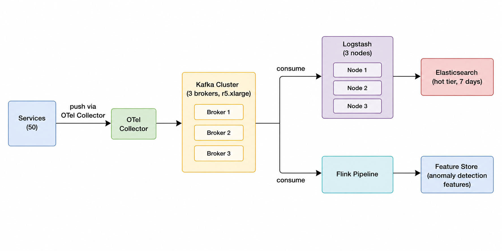

# ADR-001: Use Kafka for Log Transport Layer

## Status
Accepted (30/05/2026)

---

## Context

Hệ thống AIOps platform hiện tại có 50 services đang push log trực tiếp vào
Elasticsearch. Kiến trúc direct push hoạt động ổn ở giai đoạn đầu, nhưng khi
traffic tăng lên đã bộc lộ các vấn đề nghiêm trọng:

**Vấn đề 1 — Data loss tại peak traffic:**
Elasticsearch có throughput tối đa ~5,000 events/sec trên cụm hiện tại (3 nodes
r5.xlarge). Tuy nhiên lúc peak (business hours, incident storm), 50 services có
thể tạo ra tới 15,000–20,000 events/sec. ES bắt đầu trả về HTTP 429 (Too Many
Requests), các services không có retry logic → drop ~5% events. Mất khoảng
750,000–1,000,000 log events mỗi ngày.

**Vấn đề 2 — Không thể replay:**
Khi ES bị downtime (đã xảy ra 2 lần trong Q3/2024, tổng ~3 giờ), toàn bộ log
trong khoảng thời gian đó mất vĩnh viễn. Không có cách nào recover lại data
để phục vụ post-mortem investigation.

**Vấn đề 3 — Tight coupling:**
Anomaly detection pipeline và feature engineering pipeline muốn consume cùng
log stream. Hiện tại phải duplicate: mỗi service phải gửi log đến 2–3 destinations
khác nhau → tăng network overhead, tăng complexity trong service code.

**Chi phí hiện tại:** $28,000/month (ES cluster scale-up để cố gắng chịu tải).

---

## Decision

Introduce Apache Kafka cluster làm buffer layer giữa services và Elasticsearch.

**Kiến trúc mới:**

Services chỉ cần push đến một địa chỉ duy nhất: Kafka topic `logs.raw`. Kafka
lo việc buffer, replay, và fan-out đến nhiều consumers.

**Kafka configuration:**
- 3 brokers, replication factor 3 → no data loss nếu 1 broker chết
- Retention: 72 giờ trên Kafka (đủ để replay nếu ES downtime)
- Partition: 50 partitions (1 per service) → parallel consumption
- Compression: LZ4 → giảm ~60% disk usage trên Kafka

---

## Consequences

**Tích cực:**

- **Không còn data loss:** Kafka buffer hấp thụ peak traffic. Test với 50,000
  events/sec trong 10 phút → 0 events dropped. ES consumer đọc ở tốc độ ổn định
  5,000 events/sec, xử lý hết backlog trong ~30 phút sau peak.

- **Replay capability:** Khi ES downtime, Kafka vẫn giữ 72 giờ log. Sau khi ES
  recover, Logstash tự động replay từ offset cuối cùng. Đã test: recover 3 giờ
  log mất trong ~18 phút.

- **Fan-out miễn phí:** Flink pipeline consume cùng Kafka topic để extract
  features cho anomaly detection model. Không cần service gửi log 2 lần.

- **Cost savings:** Scale down ES cluster từ 6 nodes xuống 3 nodes (không cần
  over-provision để chịu peak) → tiết kiệm $8,000/month. Kafka cluster thêm
  $1,500/month. Net saving: **$6,500/month**.

**Tiêu cực:**

- **Latency tăng +10–15ms end-to-end:** Log phải đi qua Kafka trước khi vào ES.
  Đây là acceptable trade-off cho log pipeline (không cần real-time ms-level).
  Tuy nhiên KHÔNG phù hợp cho alerting pipeline — alerting vẫn dùng direct push
  riêng để đảm bảo <5ms latency.

- **Operational complexity tăng:** Phải maintain thêm Kafka cluster. Ước tính
  1 SRE tốn thêm 20% thời gian (khoảng 32h/month × $80/h = $2,560/month) cho
  Kafka ops: monitor, patch, rebalance partitions.

- **Single point of failure mới:** Nếu toàn bộ Kafka cluster chết, log pipeline
  bị gián đoạn. Mitigate bằng replication factor 3 và multi-AZ deployment.
  Estimated Kafka availability: 99.95% (dựa trên Confluent SLA benchmark).

**Cost summary:**
| Item | Before | After | Delta |
|---|---|---|---|
| ES cluster | $28,000 | $14,000 | -$14,000 |
| Kafka cluster | $0 | $1,500 | +$1,500 |
| SRE overhead | $1,600 | $4,160 | +$2,560 |
| **Total** | **$29,600** | **$19,660** | **-$9,940/month** |

---

## Alternatives Considered

**1. Scale ES cluster horizontally ($50,000/month)**
Tăng ES từ 6 nodes lên 18 nodes để chịu peak 20,000 events/sec. Chi phí tăng
gần gấp đôi, vẫn không giải quyết được vấn đề replay và fan-out. Bị loại.

**2. Direct push với client-side rate limiting**
Services tự throttle, không gửi quá 100 events/sec/service. Tổng max throughput
= 5,000 events/sec — vừa đủ với ES hiện tại. Vấn đề: vẫn có data loss nếu
service crash giữa chừng, không có replay, không fan-out được. Bị loại.

**3. Vector aggregator không có Kafka ($500/month)**
Vector là high-performance log aggregator (Rust, nhanh hơn Logstash 10x). Có
thể buffer trong memory và disk. Nhưng không có replay từ offset, retention
giới hạn bởi disk size của máy chạy Vector, không support multiple consumers
độc lập. Bị loại vì thiếu replay capability.

**4. Confluent Cloud (managed Kafka, $3,500/month)**
Managed service, không cần SRE maintain. Chi phí cao hơn self-hosted Kafka
$2,000/month nhưng tiết kiệm SRE time. Có thể revisit khi team SRE quá tải.
Để ngỏ như option upgrade trong tương lai.

---

## Review Date

Quyết định này sẽ được review lại sau 6 tháng (2025-06-02) hoặc khi:
- Service count vượt 200 (cần re-evaluate partition strategy)
- SRE team phản ánh Kafka ops tốn > 40% thời gian
- Confluent Cloud giảm giá xuống dưới $2,000/month
