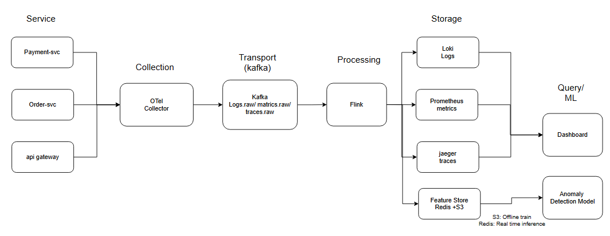
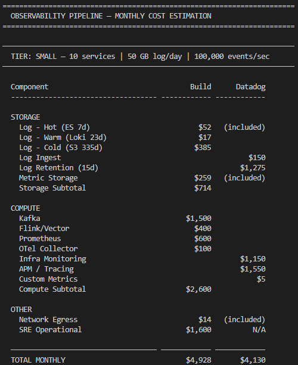
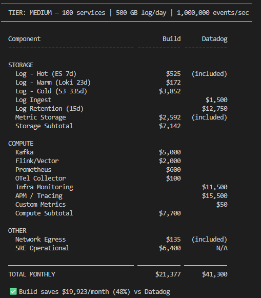
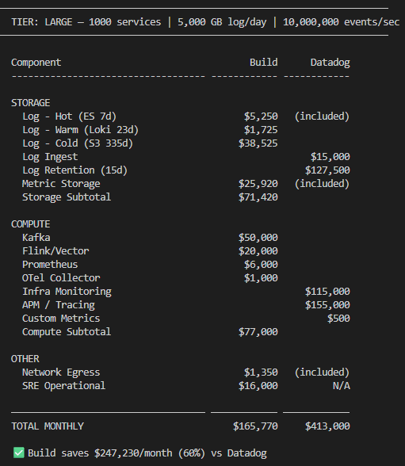
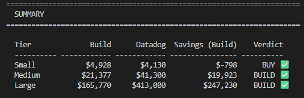

# W1-D3: Data Layer Architecture + Observability Pipeline
## Submission

---

## 1. Architecture Diagram

> Use case: **Anomaly Detection on Payment Service**

**Mô tả:**
Pipeline E2E gồm 6 layers:
- **Services** → payment-service, order-service, api-gateway emit metrics/logs/traces qua OTel SDK
- **Collection** → OTel Collector (DaemonSet) thu thập và chuẩn hóa data
- **Transport** → Kafka buffer 3 topics riêng biệt: `logs.raw`, `metrics.raw`, `traces.raw`
- **Processing** → Flink filter/enrich/sample, routing đến đúng storage
- **Storage** → Loki (hot 7d) + S3 (cold 365d) cho log, Prometheus cho metric, Jaeger cho trace, Feature Store (Redis + S3) cho ML
- **Query/ML** → Grafana dashboard, Anomaly Detection Model, Alertmanager + PagerDuty

---

## 2. Cost Estimate

## 3. ADR Decision Summary

**ADR-001: Use Kafka for Log Transport Layer**
**Status:** Accepted (30/05/2026)

**Vấn đề:** Hệ thống đang có 50 services push log thẳng vào Elasticsearch. Bình thường thì ổn, nhưng lúc peak traffic ES bắt đầu không chịu nổi (khoảng 15K-20K events/sec) và bắt đầu drop events — mất khoảng 5% log mỗi ngày. Cái đáng sợ hơn là khi ES bị downtime thì log trong khoảng đó mất luôn, không recover được. Thêm nữa là anomaly detection pipeline cũng muốn đọc cùng stream log đó nhưng không có cách nào fan-out.

**Quyết định:** Thêm Kafka vào giữa services và ES. Services push vào Kafka, Logstash/Flink consume từ Kafka rồi mới ghi vào ES. Kafka đóng vai trò buffer — dù downstream có chậm hay chết thì data vẫn không mất, replay được trong vòng 72 giờ.

**Trade-offs chính:**

Cái trade-off mình thấy đáng chú ý nhất là latency tăng thêm 10-15ms. Với log pipeline thì chấp nhận được, nhưng nếu sau này cần real-time alerting thì phải xử lý riêng, không qua Kafka được.

**Alternatives đã loại:** Scale ES horizontally ($50K/month), direct push với rate limiting (vẫn mất data), Vector aggregator không có Kafka (không replay được).

---

## 4. Reflection — Build vs Buy cho Startup 50-service vừa raise Series A?

### Context

Startup vừa raise Series A. Có khoảng 50 services, team engineering khoảng 15–30 người, có thể có 1–2 SRE hoặc DevOps. Budget không phải vô hạn nhưng cũng không quá tight. Tốc độ quan trọng — cần ship feature nhanh, không muốn bị distracted bởi infra.

Nhìn vào cost model: 50 services nằm giữa Small và Medium tier.
- Build estimate: ~$13,000/month
- Datadog estimate: ~$22,000/month
- Difference: ~$9,000/month = $108,000/year

### Recommendation: Hybrid — Buy now, plan to Build later

**Giai đoạn 1 (0–12 tháng): Buy Datadog**

Lý do chính không phải là cost — mà là **opportunity cost**.

Ở Series A, mỗi engineer-hour dành cho infra là một engineer-hour không dành cho product. Startup thua không phải vì observability cost cao — mà vì build sản phẩm chậm hơn competitor. $9,000/month chênh lệch so với Datadog là rẻ hơn nhiều so với việc thuê 1 SRE full-time (~$15,000/month) để maintain self-hosted stack.

Ngoài ra, ở giai đoạn này data về hệ thống còn chưa ổn định — service count tăng nhanh, architecture thay đổi liên tục. Self-host lúc này nghĩa là migrate liên tục.

**Điều kiện để chuyển sang Build (giai đoạn 2):**

- Service count vượt 100 (lúc đó Datadog cost vượt $40K/month, ROI của self-hosting rõ ràng)
- Có ít nhất 2 SRE dedicated cho platform
- Architecture đã tương đối stable, không còn thay đổi lớn mỗi tháng
- Datadog bill chiếm >5% tổng engineering budget

**Nếu bắt buộc phải build ngay:**

Chọn stack tối giản, đừng overengineer:
- OTel Collector → Loki + Prometheus + Tempo (cả 3 của Grafana Labs, tích hợp tốt với nhau)
- Bỏ Kafka ở giai đoạn đầu — direct push với buffer nhỏ là đủ cho 50 services
- Grafana Cloud free tier cho dashboard
- Thêm Kafka khi thật sự cần (khi ES/Loki bắt đầu drop events)

**Tóm lại:**

> Ở Series A với 50 services, pay Datadog để team tập trung build product. Khi raise Series B và service count vượt 100, lúc đó mới có đủ scale, team, và data để justify self-hosting.

---

*Submitted: Accepted (30/05/2026)*
*Use case: Anomaly Detection on Payment Service*
*Stack: OTel → Kafka → Flink → Loki/Prometheus/Jaeger → Feature Store → Grafana/ML Model*
